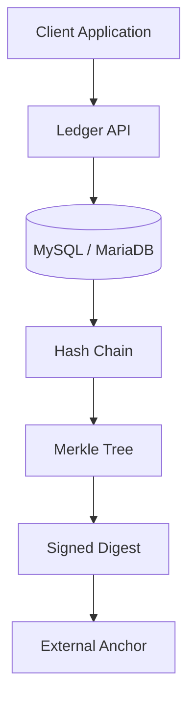
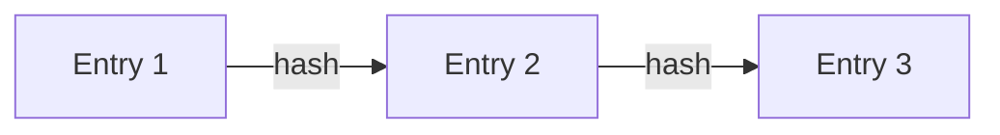
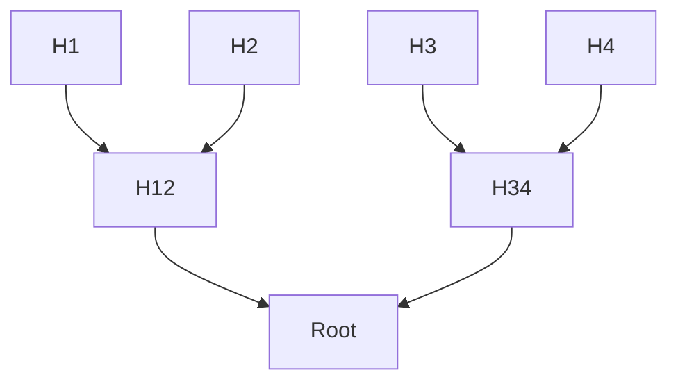

# Loop Ledger Service

[](https://codecov.io/gh/your-org/loop-ledger-service)
[](https://nodejs.org/)
[](https://www.typescriptlang.org/)
[](https://fastify.dev/)
[](LICENSE)

A lightweight cryptographic append-only ledger built with Node.js, TypeScript, Fastify and MySQL/MariaDB.

It provides tamper-evident event storage using:

- SHA-256 hash chains  
- Ed25519 digital signatures  
- Daily Merkle trees  
- Verifiable Merkle proofs  
- Public verification endpoints  
- API-key protected write endpoints  

---

## Why this exists

Most systems store critical data (grades, logs, events) in databases that can be silently modified.

This project exists to solve a simple problem:

> How can we make data integrity **verifiable**, without making data **public**?

Instead of exposing sensitive data, this service exposes **cryptographic proofs**.

This enables:

- auditability without data leakage  
- integrity guarantees without blockchain complexity  
- trust minimization in centralized systems  

Typical use cases:

- school grade registers  
- audit logs  
- document lifecycle tracking  
- compliance systems  
- financial or administrative records  

---

## Architecture



---

## Data Integrity Model



Each entry depends on the previous one.  
Changing one entry breaks the entire chain.

---

## Merkle Tree



This allows verifying a single entry without exposing all data.

---

## Features

- Append-only ledger
- SHA-256 hash chain
- Ed25519 signatures
- Daily Merkle root aggregation
- Merkle proof generation and verification
- Public verification endpoints
- API key protection for writes
- Rate limiting
- Audit logging
- External anchoring

---

## Quick Start

### Install

```bash
npm install
```

### Build

```bash
npm run build
```

### Start

```bash
npm start
```

Service runs on:

```
http://localhost:3000
```

---

## Configuration

Create a `.env` file:

```env
API_KEY=change-me

DB_HOST=localhost
DB_PORT=3306
DB_USER=ledger_user
DB_PASS=change-me
DB_NAME=ledger

PRIVATE_KEY_PATH=./private.pem
PUBLIC_KEY_PATH=./public.pem
ANCHOR_PATH=./anchors

PORT=3000
```

---

## Generate Keys

```bash
node generate-keys.cjs
```

Never commit private keys.

---

## Database Setup

```sql
CREATE DATABASE ledger;
```

Then run:

```
sql/schema.sql
```

---

## API Examples (curl)

### Create Entry

```bash
curl -X POST http://localhost:3000/entries \
  -H "Content-Type: application/json" \
  -H "x-api-key: dev-secret-key" \
  -d '{
    "streamId": "grades:cvsg",
    "eventType": "GradeCreated",
    "payload": {
      "gradeId": "grade-001",
      "studentHash": "s001",
      "value": 8
    }
  }'
```

---

### Verify Stream

```bash
curl http://localhost:3000/streams/grades%3Acvsg/verify
```

---

### Create Digest

```bash
curl -X POST http://localhost:3000/streams/grades%3Acvsg/digests/2026-05-04 \
  -H "Content-Type: application/json" \
  -H "x-api-key: dev-secret-key" \
  -d '{}'
```

---

### Get Proof

```bash
curl http://localhost:3000/streams/grades%3Acvsg/proof/1
```

---

### Verify Proof

```bash
curl -X POST http://localhost:3000/verify-proof \
  -H "Content-Type: application/json" \
  -d '{
    "leafHash": "...",
    "merkleRoot": "...",
    "proof": [...]
  }'
```

---

## Security Model

This is NOT a public blockchain.

It is a **private tamper-evident ledger**.

It guarantees:

- append-only data
- cryptographic integrity
- signed entries
- verifiable proofs

It does NOT guarantee:

- decentralized consensus
- protection against full system compromise
- trustless execution

For stronger guarantees, store daily anchors externally.

---

## Privacy Guidelines

Do NOT store personal data.

Bad:

```json
{ "name": "John Smith" }
```

Good:

```json
{ "studentHash": "sha256(...)" }
```

---

## Production Checklist

- Store private key outside repo
- Use secret manager or protected volume
- Enable HTTPS
- Protect write endpoints
- Enable rate limiting
- Enable audit logging
- Backup database
- Export anchors externally
- Monitor logs

---

## Docker

```bash
docker build -t loop-ledger-service .
docker run -p 3000:3000 --env-file .env loop-ledger-service
```

---

## License

MIT
